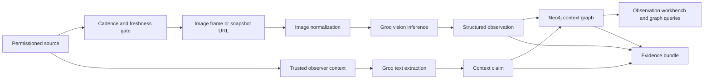

# Pipeline Explainer

## Purpose
Explain the Ethogram Graph pipeline in working language.

The prototype is a learning artifact and a product proof. Each step should make sense on its own, and each claim should map to evidence.

## The Pipeline

## 1. Source
A source is the place an image or context item comes from. The source can be a live or near-live camera, a periodic snapshot network, a trusted observer page, API-accessible commentary, or a dataset fixture.

The source record needs:

- source name
- park or place
- human review page
- image URL for the current frame
- timestamp
- freshness evidence
- update cadence evidence
- content hash
- terms or credit note
- source mode: `live_or_near_live`, `periodic_snapshot`, `stale_snapshot`, `unavailable_stream`, or `dataset_fixture`

The image URL is the machine-readable frame. The source page is for human review and traceability.

An image URL alone does not prove a live source. The system has to measure freshness and change before it can claim live or speed-sensitive monitoring.

## 2. Cadence and Freshness
The source gate decides whether the camera signal is worth analyzing with Groq.

The gate checks:

- permission or license
- latest-image endpoint or frame access
- `Last-Modified` and `ETag` headers when available
- source API dates such as `date_last`
- daily frame counts or image-list timestamps
- image hash changes across repeated probes

Groq speed matters when this gate shows repeated work: one source updating many times per day, many sources updating on moderate intervals, or a chain of several model calls per frame.

The implemented PhenoCam probe checks active site metadata, latest-image headers, API freshness dates, and recent daily image counts.

## 3. Image Normalization
Some source images are too large for Groq vision input. The bird-cam proof exposed this with an 8640 x 5760 peregrine image.

The pipeline now normalizes source frames before Groq inference. It accepts images only from trusted HTTPS hosts, fetches the image with redirect blocking, reads its dimensions and byte size, preserves the original source URL, and submits a resized JPEG when the original frame exceeds the model limits. Each observation records the original dimensions, submitted dimensions, submitted byte size, and whether resizing happened.

This keeps the source traceable while giving the model an image it can accept.

## 4. Groq Inference

Inference means asking a model to produce an answer from an input. Here the input is a camera image and a prompt. Groq returns a structured observation.

The useful output is not a paragraph. The useful output is a validated object:

- species candidates
- risks
- actions
- open questions
- summary
- confidence
- model name
- prompt version
- latency
- validation status

Groq matters here when the workflow depends on many small model calls that need to stay fast: check the frame, identify candidates, name uncertainty, create review questions, and prepare graph writes.

For observer context, Groq can also turn moderator notes, official updates, recaps, or permitted chat messages into structured claims.

## 5. Structured Observation
The observation is the contract between AI output and the rest of the product.

The schema prevents the model from becoming loose prose. If the output cannot match the schema, it should fail validation instead of entering the graph as if it were reliable.

Current validation states:

- `fixture`: development placeholder
- `valid`: model output matched the schema
- `invalid`: model output failed validation

## 6. Context Graph
The graph stores observations as connected facts.

Core nodes:

- `Source`
- `Frame`
- `Observation`
- `SpeciesCandidate`
- `Place`
- `Risk`
- `Action`
- `Question`
- `Run`

Core relationships:

- `CAPTURED_FROM`
- `OBSERVED_AT`
- `SUGGESTS_SPECIES`
- `RAISES_RISK`
- `REQUIRES_ACTION`
- `RAISES_QUESTION`
- `SUPPORTED_BY`
- `GENERATED_IN_RUN`

The graph lets the product answer relationship questions: which source produced this observation, what model run generated it, which risks are unresolved, which actions need review, and what evidence supports a claim.

The planned context layer adds `CommentarySource`, `CommentaryEvent`, `ContextClaim`, and `Behavior` nodes so model observations can be supported or challenged by human context.

## 7. Dashboard
The dashboard is the review surface. It should show source cadence, current frame or snapshot, source status, extraction mode, graph mode, confidence, latency, observer context, review queue, and graph relationships.

The UI should never blur fixture proof, Groq proof, and Neo4j proof. Each mode needs to be visible.

## 8. Evidence
Evidence is the record that the pipeline actually ran.

For each proof gate, record:

- source used
- source mode
- source freshness and cadence evidence
- model or fixture mode
- graph mode
- prompt version
- latency
- validation status
- observed summary
- test output
- screenshots when UI changed

## Current Read
The project has proved pieces of the pipeline:

- PhenoCam source-cadence adapter and API route
- first Groq extraction through the product path
- image normalization for oversized source images
- known-context Groq proof using Channel Islands bird-cam imagery
- GitHub repository, issues, backlog structure, and CI setup

The project has a first source-cadence probe. The next implementation step is timed polling and changed-frame detection across several PhenoCam sites, then observer-context ingestion research against a Big Bear-style source family.

## Change Log
- 2026-06-28: Recentered the pipeline on Ethogram Graph, added observer context, and recorded the implemented PhenoCam probe.
- 2026-06-28: Added cadence and freshness as the source gate and corrected the NPS current-source claim.
- 2026-06-27: Added the trusted-host boundary for server-side image normalization.
- 2026-06-27: Updated the pipeline read after product image normalization passed the bird-cam proof.
- 2026-06-27: Added image normalization after the bird-cam proof exposed Groq image-size limits.
- 2026-06-27: Created first pipeline explainer for the learning/context layer.
