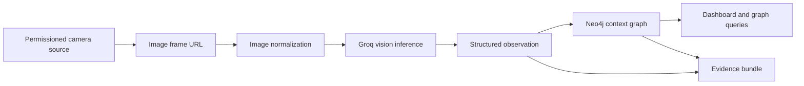

# Pipeline Explainer

## Purpose
Explain the Conservation Signal Graph pipeline in working language.

The prototype is a learning artifact and a product proof. Each step should make sense on its own, and each claim should map to evidence.

## The Pipeline

## 1. Source
A source is the place an image comes from. In this project, the first source type is an official NPS webcam record.

The source record needs:

- source name
- park or place
- human review page
- image URL for the current frame
- timestamp
- terms or credit note
- source mode: `live_camera` or `dataset_fixture`

The image URL is the machine-readable frame. The source page is for human review and traceability.

## 2. Image Normalization
Some source images are too large for Groq vision input. The bird-cam proof exposed this with an 8640 x 5760 peregrine image.

The pipeline now normalizes source frames before Groq inference. It accepts images only from trusted HTTPS hosts, fetches the image with redirect blocking, reads its dimensions and byte size, preserves the original source URL, and submits a resized JPEG when the original frame exceeds the model limits. Each observation records the original dimensions, submitted dimensions, submitted byte size, and whether resizing happened.

This keeps the source traceable while giving the model an image it can accept.

## 3. Groq Inference

Inference means asking a model to produce an answer from an input. Here the input is a camera image and a prompt. Groq returns a structured observation.

The useful output is not a paragraph. The useful output is a validated object:

- species candidates
- risks
- actions
- open questions
- summary
- confidence
- model name
- prompt version
- latency
- validation status

Groq matters here when the workflow depends on many small model calls that need to stay fast: check the frame, identify candidates, name uncertainty, create review questions, and prepare graph writes.

## 4. Structured Observation
The observation is the contract between AI output and the rest of the product.

The schema prevents the model from becoming loose prose. If the output cannot match the schema, it should fail validation instead of entering the graph as if it were reliable.

Current validation states:

- `fixture`: development placeholder
- `valid`: model output matched the schema
- `invalid`: model output failed validation

## 5. Context Graph
The graph stores observations as connected facts.

Core nodes:

- `Source`
- `Frame`
- `Observation`
- `SpeciesCandidate`
- `Place`
- `Risk`
- `Action`
- `Question`
- `Run`

Core relationships:

- `CAPTURED_FROM`
- `OBSERVED_AT`
- `SUGGESTS_SPECIES`
- `RAISES_RISK`
- `REQUIRES_ACTION`
- `RAISES_QUESTION`
- `SUPPORTED_BY`
- `GENERATED_IN_RUN`

The graph lets the product answer relationship questions: which source produced this observation, what model run generated it, which risks are unresolved, which actions need review, and what evidence supports a claim.

## 6. Dashboard
The dashboard is the review surface. It should show the current frame, source status, extraction mode, graph mode, confidence, latency, review queue, and graph relationships.

The UI should never blur fixture proof, Groq proof, and Neo4j proof. Each mode needs to be visible.

## 7. Evidence
Evidence is the record that the pipeline actually ran.

For each proof gate, record:

- source used
- source mode
- model or fixture mode
- graph mode
- prompt version
- latency
- validation status
- observed summary
- test output
- screenshots when UI changed

## Current Read
The project has passed:

- NPS live-source proof with Yosemite Falls
- first real Groq extraction with Yosemite Falls
- known-context Groq proof with Channel Islands bird cams through the product normalization path
- GitHub repository, issues, Project board, and CI setup

The next implementation step is to surface model-run and frame-normalization details in the UI before Neo4j persistence.

## Change Log
- 2026-06-27: Added the trusted-host boundary for server-side image normalization.
- 2026-06-27: Updated the pipeline read after product image normalization passed the bird-cam proof.
- 2026-06-27: Added image normalization after the bird-cam proof exposed Groq image-size limits.
- 2026-06-27: Created first pipeline explainer for the learning/context layer.
